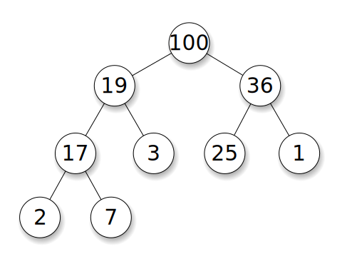

## Heap

- `힙`은 Complete Binary Tree 중 일부 조건을 만족하는 Tree 이다 
- 힙의 종류
  + `최대힙`(max-heap)
  + `최소힙`(min-heap)
- `Max-Heap`

  + 각 노드의 값이 children의 값보다 크거나 같다.
  + Root node의 값이 제일 큰 값이므로, 최대값을 찾는데 소요되는 시간은 O(1)이다. 
- `Min-Heap`
  + 각 노드의 값이 children의 값보다 작거나 같다.
  + Root node의 값이 제일 작은 값이므로, 최소값을 찾는데 소요되는 시간은 O(1)이다.   
- 힙에서 삽입, 삭제 연산이 일어난 경우     
  + 삭제 연산이 일어날 경우
    - heap 은 맨 마지막 노드를 루트 노드로 대체시킨 후, heapify 과정을 거쳐 heap 구조를 유지합니다. 이러한 heapify 연산의 시간복잡도는 O(logn)이 됩니다. 
  + 삽입 연산의 경우
    - 최대 트리의 높이만큼의 연산이 발생하므로 시간 복잡도는 O(logn)이 됩니다.