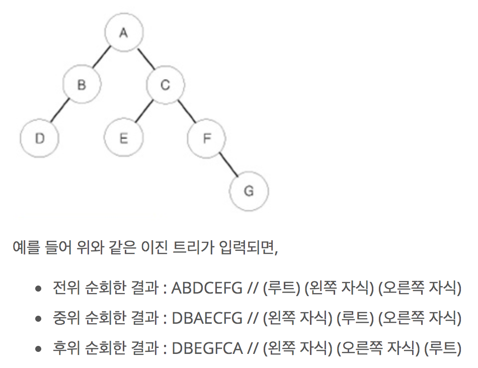

Tree
===
```트리는 사이클이 없는 연결그래프를 말한다.``` == ```노드 n개, 엣지 n-1개인 연결그래프```  
- 그래프에 속하므로 BFS, DFS가 적용된다
- 트리는 ```전위순회```(preorder), ```중위순회```(inorder), ```후위순회```(postorder) 탐색이 가능하다 


### 전위순회, 중위순회, 후위순회 방법



### 트리 생성 방법
1. `인접행렬`
  각 노드 간의 연결 유무를 2차원 배열로 저장. 복잡하고 메모리 낭비가 심함     
2. `인접리스트`
  자신과 연결되어 있는 노드만 저장. 복잡
3. `부모의 인덱스를 기억하는 방법`
  부모노드의 인덱스를 찾을 땐 좋지만 자식 노드는 찾기 어려움.   
4. `자식의 인덱스를 활용하는 방법(완전이진트리)`
  현재 노드가 i(부모노드)라면 왼쪽 자식노드는 2i, 오른쪽 자식노드는 2i+1가 되도록 저장. 완전 이진트리가 아니면 메모리 낭비
5. `자식 인덱스를 저장하는 방법(이진트리)`
   부모노드가 i라면 A[i][0]에는 왼쪽 자식을, A[i][1]에는 오른쪽 자식을 저장  

